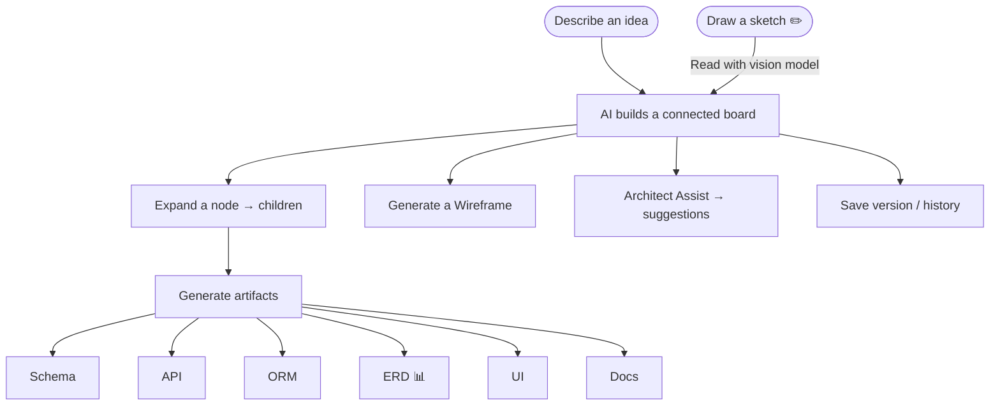
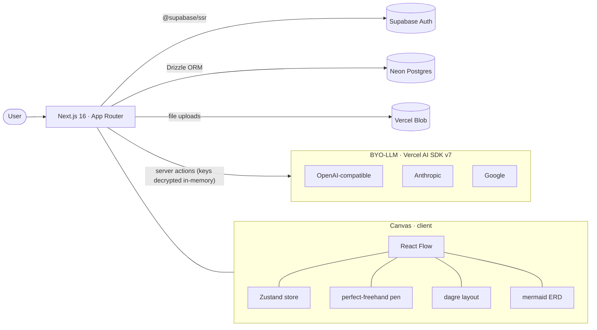
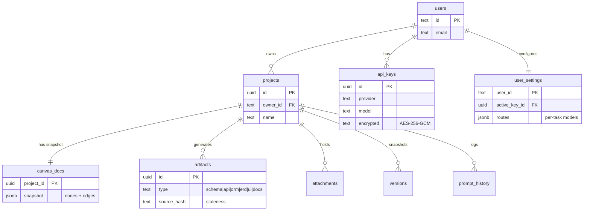

<div align="center">

# 🧩 WhiteWire

### Cursor for product teams — an AI-native canvas where ideas become connected boards, wireframes, schemas, APIs, ORM models, ER diagrams, and docs.

**Bring your own LLM. Own your intelligence.**

[](https://whitewire.vercel.app)


</div>

---

## 📑 Contents

- [What it does](#-what-it-does)
- [How it works](#-how-it-works)
- [Architecture](#-architecture)
- [Data model](#-data-model)
- [Tech stack](#-tech-stack)
- [Getting started](#-getting-started)
- [Roadmap](#-roadmap)

---

## ✨ What it does

| | |
|---|---|
| 🎨 **AI-native canvas** | Nodes, edges, text, sticky notes, shapes (rect / ellipse / diamond), and **freehand pen sketching** — built on React Flow (free in production). |
| 🔑 **BYO-LLM** | Any OpenAI-compatible endpoint (OpenAI, Groq, OpenRouter, DeepSeek, Mistral, Ollama / LM Studio) + Anthropic + Google. Keys **encrypted at rest** (AES-256-GCM), decrypted only in-memory server-side. |
| 🧠 **Generate a whole board** | Describe an idea → the AI builds a connected set of concept nodes (components + relationships), auto-laid-out with dagre. |
| 🌿 **Expand** | Grow any node into connected children. |
| 📦 **Linked artifacts** | Per node: **Schema · API · ORM · ERD · UI · Docs**. ERDs render as real **Mermaid** diagrams. Artifacts show a **stale** badge when the source changes. |
| 🖼️ **Wireframes** | Generate low-fi UI mockups as canvas nodes. |
| 🏗️ **Architect Assist** | An agent reviews the whole board and suggests what's missing / components to add — one click to drop them in. |
| 👁️ **Smart canvas** | **Refine** rewrites a node's text; **Read sketch** sends a rasterized drawing to a vision model and returns clean nodes. |
| 🔀 **Model routing** | Assign different models per task (reasoning / code / docs). |
| 📎 **Attachments** | Notes, links, comments, snippets, and **file uploads** (Vercel Blob). |
| 🕘 **History** | Version snapshots + restore, and a log of every generation. |
| 📱 **Responsive** | Works down to mobile. |

---

## 🔄 How it works



---

## 🏛️ Architecture



**Modular by responsibility**, every repo + server action **owner-scoped**:

```
core/ai/            key vault (crypto), providers, prompts, agents, vision
core/artifacts/     hashing + kind→generator routing   (pure, tested)
core/canvas/        dagre layout / cleanup             (pure, tested)
core/persistence/   Drizzle schema + owner-scoped repositories
core/state/         Zustand workspace store (graph + selection)
app/                routes + server actions
components/         React Flow canvas, nodes, tools, inspector
```

---

## 🗄️ Data model



---

## 🧰 Tech stack

| Layer | Choice |
|-------|--------|
| **Framework** | Next.js 16 (App Router, Turbopack) · React 19 · TypeScript |
| **Canvas** | React Flow (`@xyflow/react`) · `perfect-freehand` · `dagre` · `mermaid` |
| **AI** | Vercel AI SDK v7 (`@ai-sdk/openai-compatible`, `@ai-sdk/anthropic`, `@ai-sdk/google`) |
| **Auth** | Supabase Auth (`@supabase/ssr`) |
| **Database** | Neon Postgres + Drizzle ORM |
| **Storage** | Vercel Blob |
| **State / UI** | Zustand · Tailwind CSS · shadcn/ui |
| **Tests** | Vitest + PGlite (**96** tests) |
| **Deploy** | Vercel |

---

## 🚀 Getting started

```bash
pnpm install
cp .env.example .env.local     # fill in the values below
pnpm db:migrate                # apply migrations to Neon
pnpm dev                       # http://localhost:3000
```

<details>
<summary><b>Environment variables</b></summary>

```bash
DATABASE_URL=                  # Neon Postgres connection string
NEXT_PUBLIC_SUPABASE_URL=      # Supabase project URL
NEXT_PUBLIC_SUPABASE_ANON_KEY=
SUPABASE_SERVICE_ROLE_KEY=
ENCRYPTION_KEY=                # 32-byte base64 → openssl rand -base64 32
BLOB_READ_WRITE_TOKEN=         # Vercel Blob (for file uploads)
```

In-app: **Settings → add a provider key → Make active**. Groq is great for
testing (base URL `https://api.groq.com/openai/v1`, model
`llama-3.3-70b-versatile`). For **Read sketch**, set a vision model
(`gpt-4o`, `claude-3-5-sonnet`, `gemini-2.0-flash`) active.

</details>

<details>
<summary><b>Scripts</b></summary>

```bash
pnpm dev          # dev server
pnpm build        # production build
pnpm test         # 96-test suite (Vitest + PGlite)
pnpm db:generate  # generate a Drizzle migration from schema changes
pnpm db:migrate   # apply migrations
```

</details>

### Environment

- `SUPABASE_SERVICE_ROLE_KEY` — required for the **Delete account** action (Account page). Without it, deletion returns a clear error and no data is removed. Set it in `.env.local` and in the Vercel project's environment variables. Never expose this key to the client.

---

## 🗺️ Roadmap

- [x] Shell · Supabase auth · Neon DB
- [x] Canvas (React Flow) · autosave · dagre tidy
- [x] BYO-LLM · encrypted vault · command bar · Expand
- [x] Linked artifacts (Schema / API / ORM / ERD / UI / Docs) · attachments · file upload
- [x] Architect Assist agent
- [x] Version history + prompt history
- [x] Wireframes · model routing · pen sketching · **sketch → vision**
- [ ] Realtime collaboration
- [ ] Plugin marketplace
- [ ] Onboarding tour

---

<div align="center">

Built with [Claude Code](https://claude.com/claude-code).

</div>
